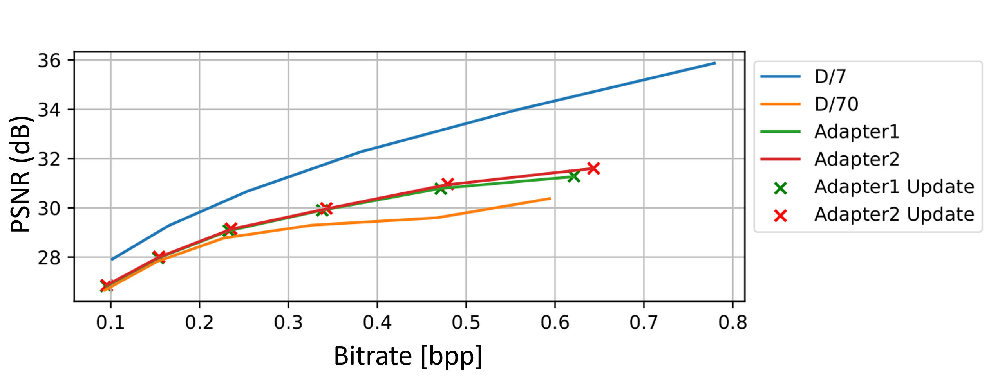
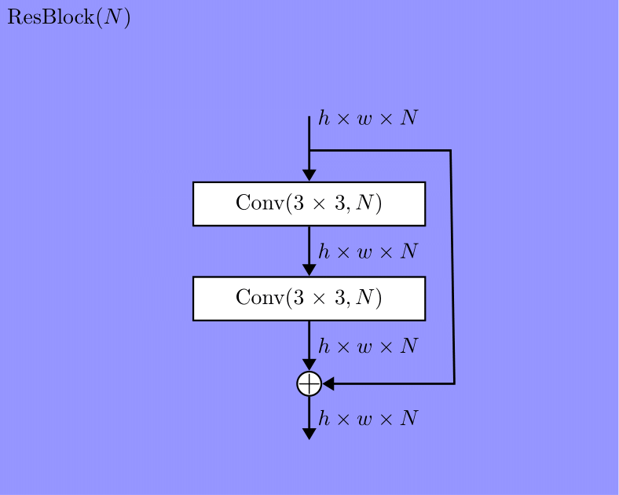
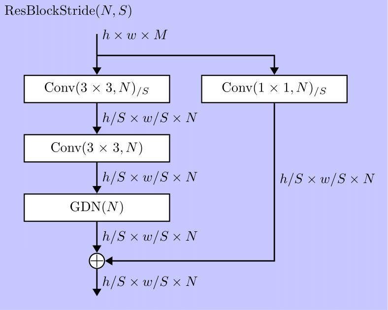
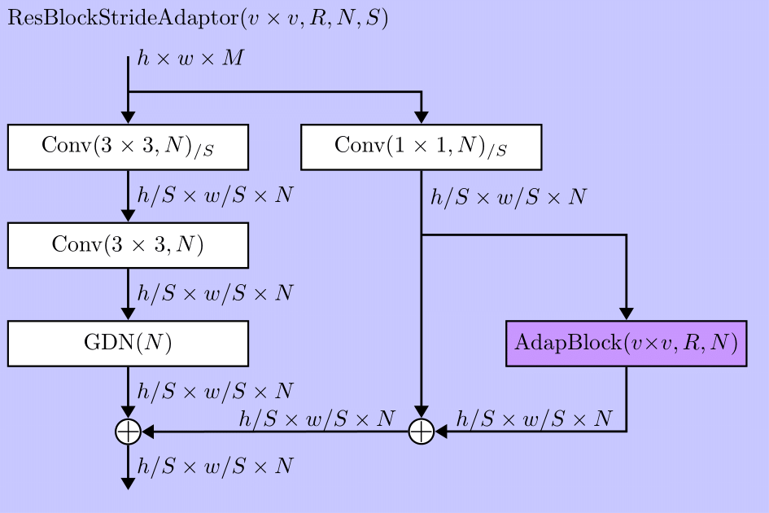
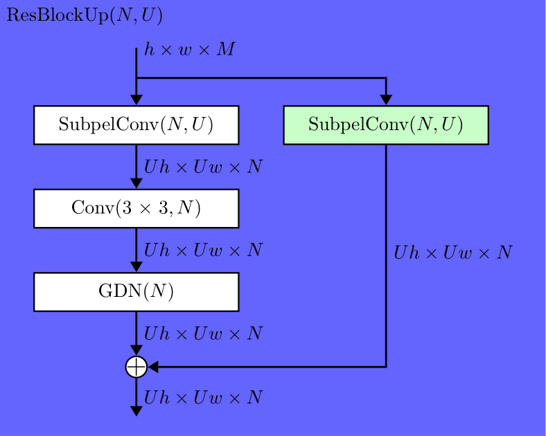
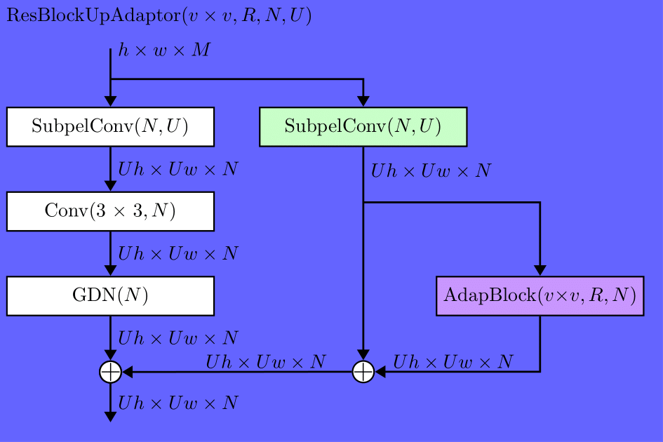
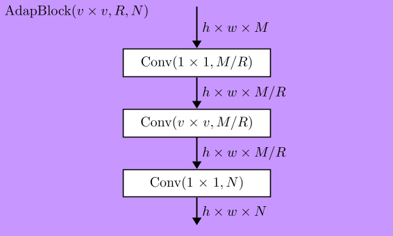

# Adapdate

  

The general idea behind this repository is to update a weak/partially learnd image codec net (D/70 learned with one 70th of the full dataset) using adapters. The codec we use is [cheng2020-anchor](https://github.com/InterDigitalInc/CompressAI) its an offspring of the [cheng2020](https://arxiv.org/abs/2001.01568) net. The way we do this is by adding to the net D/70 (a weak/partially learnd net) some adapters and train only them with i.e. the full dataset. Afterwards the learned adapters of that net can be send to any other Net D/70 (initial weights must be the same) to update them to the same performance. Coding the update is taken care of by [NNCodec](https://github.com/fraunhoferhhi/nncodec). The result shown in the graphic shows D/7 the net learned with the full dataset, D/70 the net learned with the full dataset, Adapter1 and Adapter2 which are D/70 nets which got adapters learned on the full dataset. And after compressing those adapters and transmitting them and again appliing them to a D/70 net the result can be seen by Adapter1 Update and Adapter2 Update. The adapters only make a small percentage (3% for Adapter1 and 6% for Adapter2) of the whole nets parameters, so it could be wise to only fine-tune those adapters for an update. The net Adapter1 only uses the adapters in one kind of res block, and the net Adapter2 uses the same adapter architecture but inside of three different kinds of res blocks. Further info about the adapters and their embeding can be found in the section below.

## Adapternets

The structure of the Chneg2020-anchor net is shown in the picture below. It follows the structure of a [Joint-Autoregressive Hierarchical-Prior-Net](https://arxiv.org/abs/1809.02736) but the most important thing for us are the Res-Blocks (ResBlock, ResBlockStride and ResBlockUp) which are highlited in different shades of blue.

  

Those Res-Blocks are later extendet by the adaptors which we will just add to them in their bypass. Below on the left side is the original block and on the right side the block with the added adapter.

This transition is used in the Adapternet type 1 and 2.

  
  

And the following two transitions are only used in the Adapternet type 2.

  
  

  
  

The adapter we want to add to the network is shown below. The $R$ is a reduction factor for the bottleneck we want to accive and $v$ is the kernel size for the $v \times v$ kernel of the second layer of the adapter. With those parameters we can adjust the bottleneck and the kernel in the smallest bottleneck layer.

  

## Installation 
Installation of PyTorch and TorchVision (Python version >= 3.6 is required):
<code><pre>pip3 install torch torchvision --index-url https://download.pytorch.org/whl/cu126</pre></code>

Insatallation of NNCodce (C++ compiler is required):
<code><pre>git clone https://github.com/fraunhoferhhi/nncodec.git</pre></code>
From the root of the NNCodec repository:
<code><pre>pip install wheel
pip install -r requirements.txt
pip install .</pre></code>
For the insrallation of CompressAI run:
<code><pre>pip install compressai</pre></code>

For downloading the dataset run (from Adapdate/data):
<code><pre>mkdir data
cd data
wget http://data.csail.mit.edu/tofu/dataset/vimeo_septuplet.zip
unzip vimeo_septuplet.zip
rm vimeo_septuplet.zip</pre></code>
And download all Kodak images in the folder Adapdate/data/Kodak.

The models used can be found [here](link).

## Procedure
At first the net (D/70) is being created and trained with a samll dataset:
<code><pre>python src/train.py --train-split train70 --val-split val7 --model cheng2020-anchor --savename D70_V7_Q0 --save --epochs 100 --quality 0 --data-path data/vimeo_septuplet/</code></pre>

To create the D/7 net run:
<code><pre>python src/train.py --train-split train7 --val-split val7 --model cheng2020-anchor --savename D7_V7_Q0 --save --epochs 100 --quality 0 --data-path data/vimeo_septuplet/</code></pre>

Then add adapters to a copy of our net: 
<code><pre>python src/transform_net.py --model adapter-net --model-path D70_V7_Q0.pth --v 3 --R 2</code></pre>

Train only the adapters:
<code><pre>python src/train.py --train-split train7 --val-split val7 --model adapter-net --v 3 --R 2 --unfreeze-list 0 --only-adapter --checkpoint D70_V7_Q0_to_adapter_v3_R2.pth --savename D70_V7_Q0_to_adapter_v3_R2_D7 --save --epochs 100 --quality 0 --data-path data/vimeo_septuplet/</code></pre>

Cut out the adapters:
<code><pre>python src/cut_network.py --model adapter-net --model-path D70_V7_Q0_to_adapter_v3_R2_D7.pth --v 3 --R 2</code></pre>

Compress and decompress the cutout adapters with NNCodec:
<code><pre>python src/compress_decompress_net.py --model-path only_adapter_D70_V7_Q0_to_adapter_v3_R2_D7.pth --qp -60</code></pre>

Update the Adaptor of the net the adapters have just been added (or a net with the same weights as the initialy trained net to wich adapters have been added):
<code><pre>python src/update_adapter.py --model adapter-net --model-path D70_V7_Q0_to_adapter_v3_R2.pth --adapter-path Decompressed_only_adapter_D70_V7_Q0_to_adapter_v3_R2_D7-60.pth --v 3 --R 2</code></pre>

Evaluate the nets performance:
<code><pre>python src/eval_model_all.py --test-split Kodak --model adapter-net --model-path Updated_D70_V7_Q0_to_adapter_v3_R2.pth --data-path data/Kodak</code></pre>
